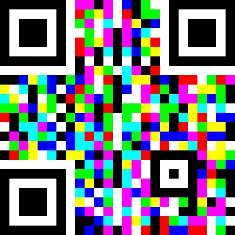
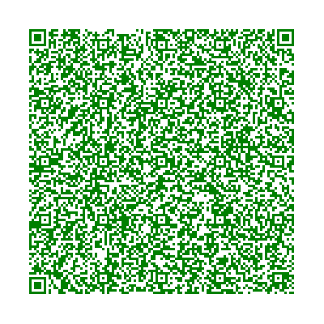
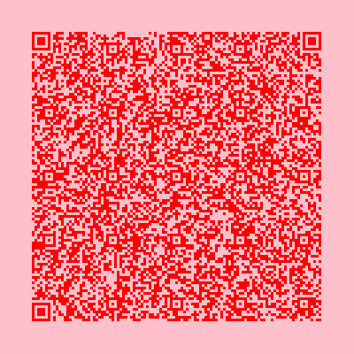
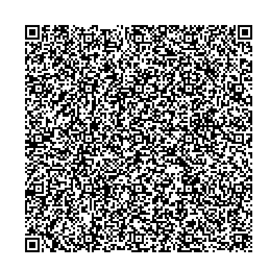
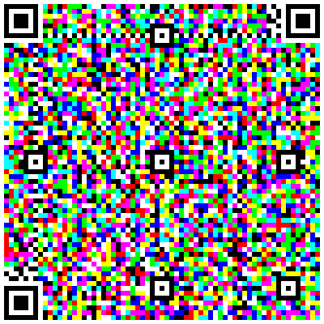

# ColorZXing.Net
A colorful QR code Generator and Decoder based on ZXing.Net



# Releases
[](https://www.nuget.org/packages/ColorZXing.Net/)
```
Install-Package ColorZXing.Net -Version 0.1.0
```
# Features
* Generate and Decode QR Code with Mono tone Color. 
```
//To generate a QR code with one color. e.g. Green
var bitmap = ColorZXingMono.Encode("This is the text you want to encode", 400, 400, 0, Color.Green);

//To generate a QR code with two colors. e.g. Red and Pink
var bitmap = ColorZXingMono.Encode("This is the text you want to encode", 400, 400, 0, Color.Red, Color.Pink);

//To decode the same QR code
var txtDecoded = ColorZXingMono.Decode(bitmapRead)
```


* Generate and Decode QR Code fully utilizing the RGB channels. In theory, you can encode 3x more information into the QR Code, compared to the black and white only method.
```
//To generate a colorful QR Code with RGB colors
var bitmap = ColorZXingRGB.Encode("This is the text you want to encode", 400, 400, 0);

//To decode the same QR Code
var txtDecoded = ColorZXingRGB.Decode(bitmap);
```

The following QR code are generated using the same text block(1200 chars).



# Performance
For a 500 x 500 QR code, the encoding and decoding each takes abuot 100 ~ 150 ms on a quad core 2GHz laptop CPU. 


